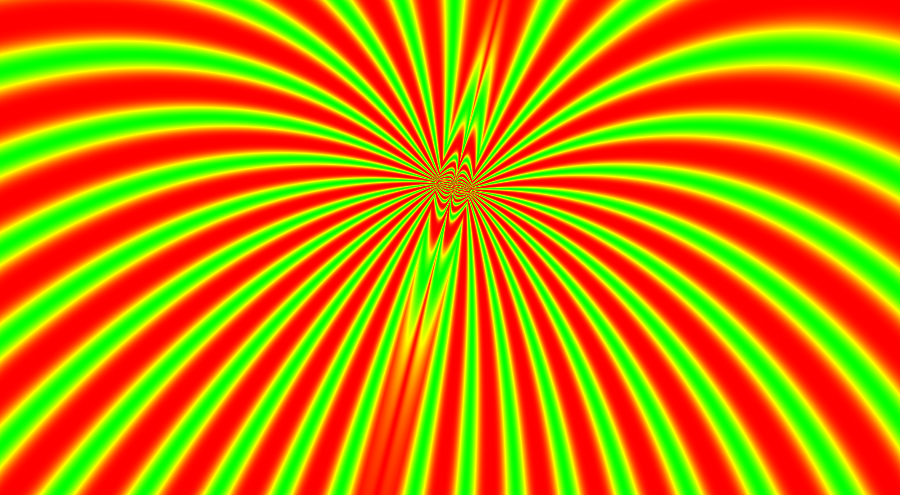
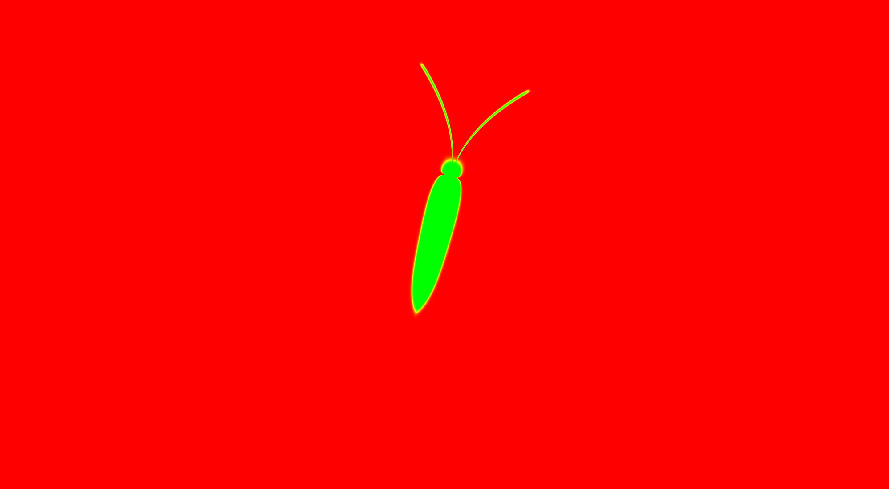
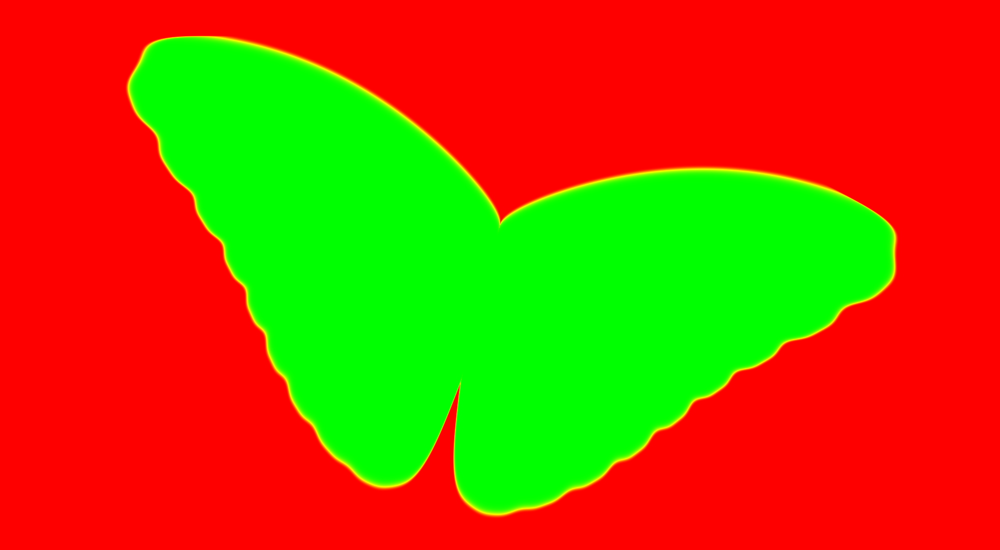
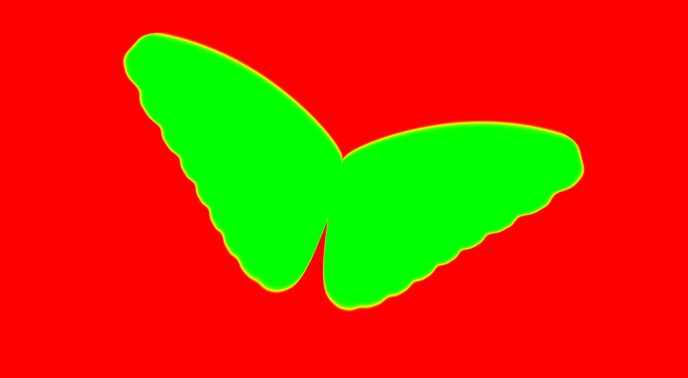
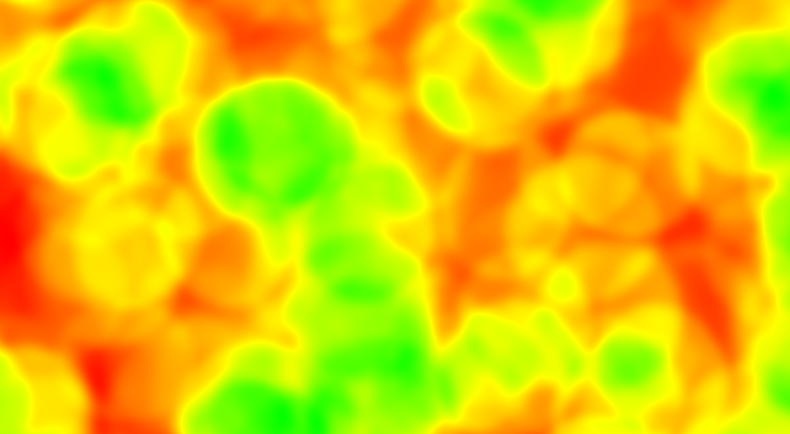
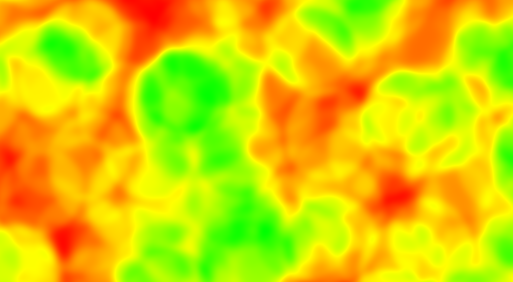
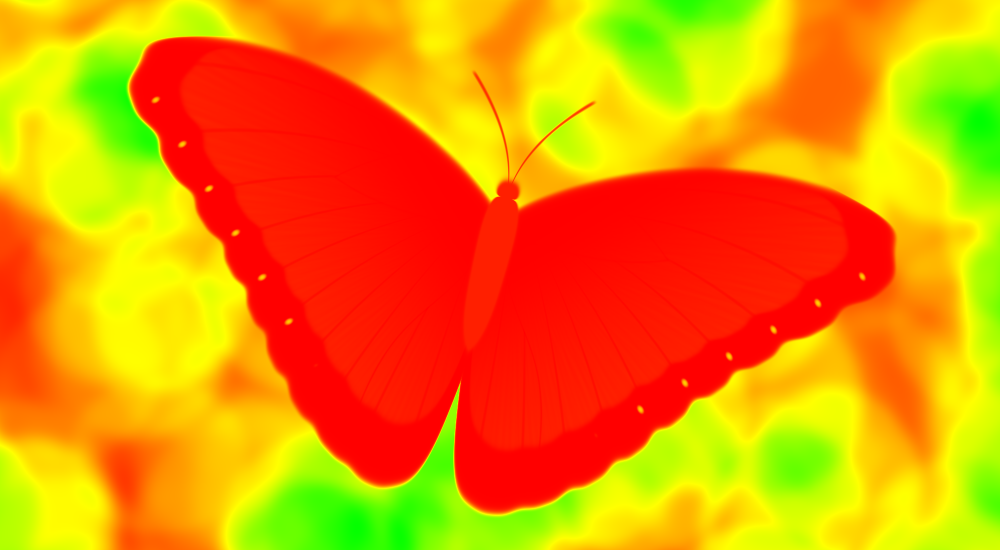
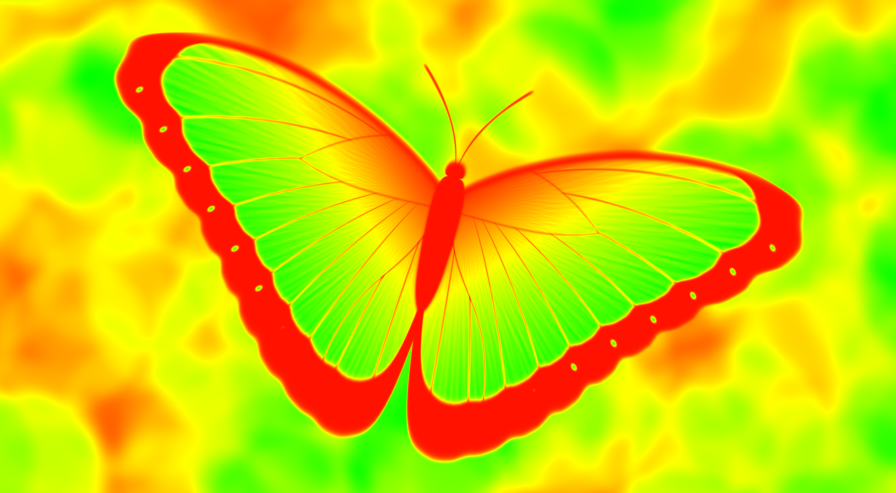
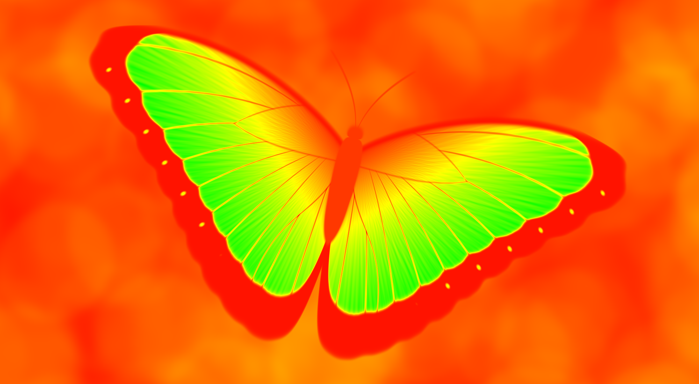

# cl-morpho-butterfly

Hamid Naderi Yeganeh is an artist which draws pictures with mathematical equations: [Wikipedia](https://en.wikipedia.org/wiki/Hamid_Naderi_Yeganeh), [X](https://x.com/naderi_yeganeh), [Instagram](https://www.instagram.com/hamidnaderiyeganeh/), [YouTube](https://www.youtube.com/@naderiyeganeh).

Morpho buttterfly is one of his artworks ([X](https://www.instagram.com/p/DQmRlpliAVM/), [Instagram](https://x.com/naderi_yeganeh/status/1754107434224804305/)):

The present repository reproduces this work with Common Lisp.

The program:  
\- generates butterfly picture (by changing `NB_RUNS`, it can be done several times, to evaluate durations), and  
\- generates heatmaps of intermediate calculations.

See images below.

Any comment? Open an [issue](https://github.com/occisn/cl-morpho-butterfly/issues), or start a discussion [here](https://github.com/occisn/cl-morpho-butterfly/discussions) or [at profile level](https://github.com/occisn/occisn/discussions).

Generated butterfly:  

C heatmap:  

E heatmap:  

L heatmap:  

W heatmap:  

A0 heatmap:  

A1 heatmap:  

K0 heatmap:  

K1 heatmap:  

K2 heatmap:  

H0 heatmap:  

H1 heatmap:  

H2 heatmap:  

(end of README)
